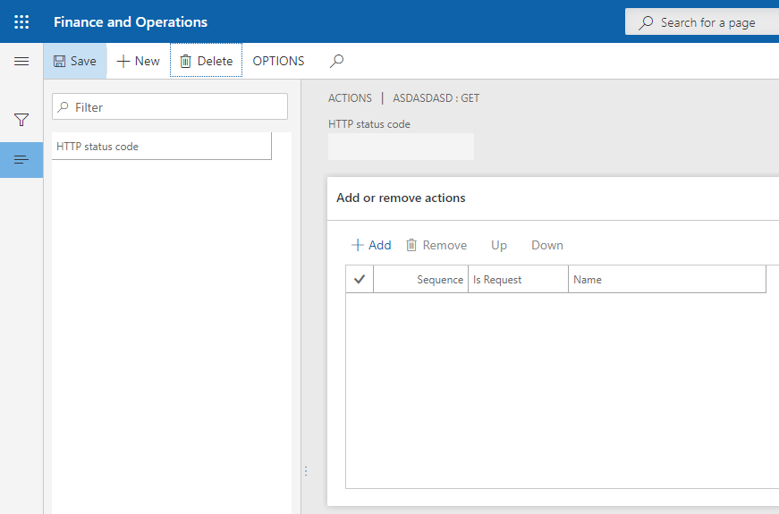

# Actions

Дуже часто при створенні запиту є потреба в обробці його відповіді, і для таких випадків існують `Actions`.
`Actions` - це послідовний набір дій з результатом запиту. Кожен запит після завершення роботи формує відповідь з кодом про свій статус. Детальніше про статуси [Тут](https://www.restapitutorial.com/httpstatuscodes.html).

Діями над результатом запиту можуть виступати інші запити з параметром `Only for internal` в значенні `Yes`, а також прив'язування для імпорту даних (параметр `Mapping processing type` в значенні `import` або `DMF Import`).



## Створення

Щоб додати `Actions` до запиту, потрібно відкрити попрередньо налаштований запит і натиснути клавішу `Actions`. після чого відкриється форма для додавання дій до відповідей для даного запиту.

Кожного разу коли буде сформовано запит, буде отримано відповідь і на оснвоі коду статусу буде обрано ланцюг дій які потрібно виконати.
Дії мають номер порядку виконання і за замовчуванням при додаванні нової дії, вона додається в кінець списку, але в будь-який момент цей порядок можна змінити клавішами `Up` та `Down`.


Наприклад, структура дій для для запиту 'Request A', може виглядати так:

```text
└── Request A
    ├── Code status 200
        ├── Request B
        └── Import
    ├── Code status 201
      ├── Request B
    └── Code status 404
        ├── Request C
        └── DMF Import
```
