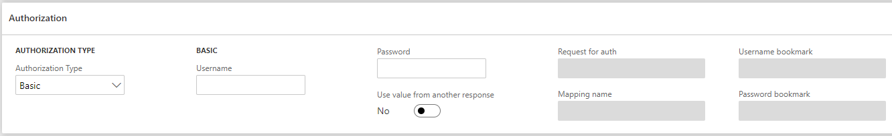
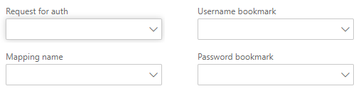

# Basic authorization

Даний тип авторизації потребує даних про логін та пароль користувача для авторизації в сервісі з яким відбувається обмін даними.
Також є можливість отримати параметри за допомогою відповіді від іншого запиту.



Поле `Use value from another response` дозволяє налаштувати отримання даних, що прийдуть у відповідь при відправці іншого запиту.



При встановленні даного параметру в значення `Так` отримується можливість налаштувати отримання значень `Username` та `Password` з отриманої відповіді від іншого запиту.
Значення, що будуть підставлятись отримуються за допомогою співставлення їх до структури яка налаштована і буде створена із отриманої відповіді. Детальніше про співставлення у посібнику [Mapping](/ua/mapping.md).

!> Для отримання значень `Username` та `Password` за допомогою `Mapping` використовуйте тип співставлення `Парсинг`.

?> При зміні значення поля `Use value from another response` поля `Username` та `Password` не змінюються, а лише змінюється можливість їх редагування. Всі інші поля в даному розіділі очищуються.

| Поле                            | Обов'язкове      | Опис                                                               |
| ------------------------------- | ---------------- | ------------------------------------------------------------------ |
| Username                        | <code>Так</code> | Логін                                                              |
| Password                        | <code>Так</code> | Пароль                                                             |
| Use value from another response | <code>Ні</code>  | Використовує identity для авторизації типу Basic з іншої відповіді |
| Request for auth                | <code>Так</code> | Назва запиту                                                       |
| Mapping name                    | <code>Так</code> | Назва співставлення                                                |
| Username bookmark               | <code>Так</code> | Bookmark для `Логін`                                               |
| Password bookmark               | <code>Так</code> | Bookmark для `Пароль`                                              |

!> Поле `Request for auth` може мати значення запитів, що є `Only for internal`. Обрати в якості значення нинішній запит неможливо.

!> Поле `Mapping name` може мати значення співставлень, що мають значення поля `Mapping processing type` ідентичне `Parser`.

Якщо для запиту поле `Make history` встановлено в значення `Так`, тоді при використанні іншого запиту для отримання даних для авторизації, для цього запису історія буде створена в рамках його налаштувань. Наприклад:

```text
'Request A' uses 'Request B'
'Request A' do not make history
'Request B' make history

When 'Request A' will be invoked, history will be created only for 'Request B'
```
