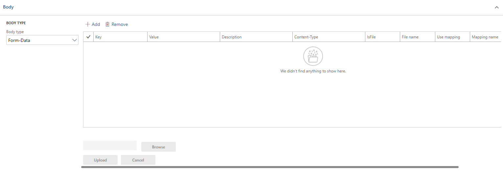

# Body Form-Data

Даний тип тіла запиту є найбільш універсальним типом, тому що поєднує в собі всі інші типи. При створені тіла запиту з даним типом, поле `Content-Type` буде мати значення `multipart/form-data`.



Запит із даним типом тіла буде створено один раз в рамках процесу, незалежно від того скільки записів було створено в області введення даних в розділі `Body`. Додавати дані в тіло запиту можна декількома способами:

## Простий запит

Щоб додати дані в тіло запиту, потрібно створити новий запис в області введення даних (натиснути клавішу `Add`) і заповнити поле `Key`. Поле `Value` є не обов'язковим.

> Поле `Value` може мати пусте значення, але, зазвичай, такі запити, що будуть сформовані не мають сенсу.

Поле `Content-Type`, що знаходиться в розділі `Body` потрібно встановити відповідно до типу даних, що містяться в полі `Value`. Поле `Description` є не обов'язковим.

## Запит з файлом

При встановленні поля `IsFile` в значення `Yes`, стає можливим додати файл (стають доступними для натискання клавіші для вибору та завантаження файлу). Щоб прикріпити до запиту файл, потрібно його відкрити за допомогою клавіші `Browse` і після цього завантажити його в систему натиснувши на клавішу `Upload`. Після успішного завантаження файлу поле `File name` заповниться іменем завантаженого файлу.

?> Якщо прикріпити файл а потім змінити значення поля `IsFile`, і використовувати інший тип додавання даних до тіла запиту, то вміст, що завантажився очищено `не буде`. Видалити вміст можна видаливши запис з області введення даних (натиснути клавішу `Remove`) або перезаписати завантаживши інший файл.

## Запит на основі співставлення

Поле `Use mapping` дозволяє обрати співставлення на основі якого будуть створені дані отримані на основі даних з `Dynamics 365 for Finance and Operations`. При встановлені його в значення `Yes`, ми матимемо можливість обрати співставлення із списку.

!> Поле `Mapping name` може мати значення співставлень, що мають значення поля `Mapping processing type` ідентичне `Export`.

Значення для поля `Mapping name` будуть сформовані відповідно до джерела даних з яким пов'язаний запит (Поле `Data source name` на формі `Request group`).

?> При зміні значення поля `Use mapping` в значення `Yes`, поле `IsFile` встановлюється в значення `No`. Така ж логіка і при зміні поля `IsFile`.

Кількість записів в в області введення даних в даному розділі є необмеженою. Але ми рекомендуємо не створювати тяжких запитів (ті, що містять великий набір даних), щоб уникати помилок при надсиланні таких запитів.

| Поле         | Обов'язкове                                  | Опис                                                        |
| ------------ | -------------------------------------------- | ----------------------------------------------------------- |
| Key          | <code>Так</code>                             | Ключ складової тіла запиту                                  |
| Value        | <code>Ні</code>                              | Значення частини тіла запиту                                |
| Description  | <code>Ні</code>                              | Опис частини тіла запиту                                    |
| Content-Type | <code>Ні</code>                              | Тип даних частини тіла запиту                               |
| IsFile       | <code>Ні</code>                              | Додавання файлу як частину тіла запиту                      |
| File name    | <code>Ні</code> (недоступне для редагування) | Назва файлу (встановлюється автоматично після завантаження) |
| Use mapping  | <code>Ні</code>                              | Створення даних для запиту на основі співставлення          |
| Mapping name | <code>Ні</code>                              | Назва співставлення                                         |

Приклад запиту з тілом даного типу:

```text
POST /test.html HTTP/1.1
Host: example.org
Content-Type: multipart/form-data;boundary="boundary"

--boundary
Content-Disposition: form-data; name="field1"

value1
--boundary
Content-Disposition: form-data; name="field2"; filename="example.txt"

value2
```
