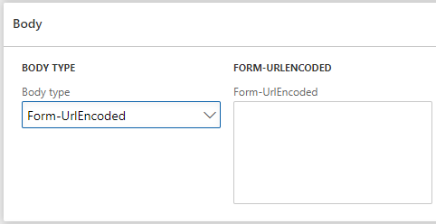

# Body Form-UrlEncoded

Запит з даним типом тіла буде містити тип контенту `application/x-www-form-urlencoded` і контент, що буде передано без будь-яких конвертувань. Більше про правила створення контенту для запиту з таким типом дивіться [Тут](https://url.spec.whatwg.org/#concept-urlencoded)



Щоб додати дані в тіло запиту з даним типом, потрібно просто заповнити поле `Form-UrlEncoded` необхідним значенням.

Приклад запиту з тілом даного типу:

```text
POST / HTTP/1.1
Host: foo.com
Content-Type: application/x-www-form-urlencoded
Content-Length: 13

say=Hi&to=Mom
```
