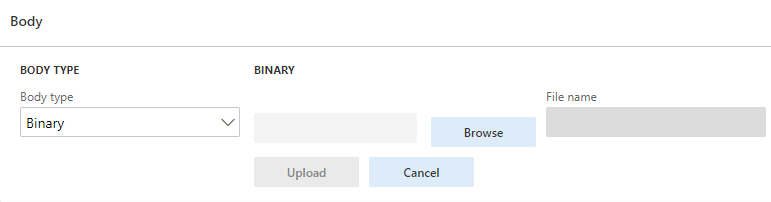

# Body Text

Тіло з даним типом дозволяє передавати будь-які файли як двійкові.

Щоб додати дані в тіло запиту з даним типом, потрібно відкрити файл за допомогою клавіші `Browse` і після цього завантажити його в систему натиснувши на клавішу `Upload`. Після успішного завантаження файлу поле `File name` заповниться іменем завантаженого файлу.
