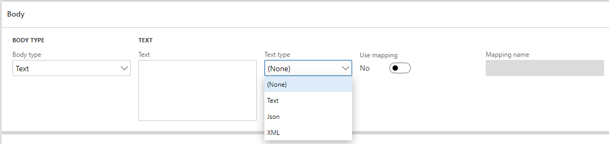

# Body Text

Запит з тілом з даним типом дозволяє передавати дані в одному із доступних текстових форматів. Тип контенту для запиту буде сформовано відповідно до обраного типу тексту - значення поля `Text type`.

Також є можливість згенерувати текстові дані у відповідному форматі за допомогою співставлення.
Детальніше про співставлення у посібнику [Mapping](/ua/mapping.md).



Щоб додати дані в тіло запиту з даним типом, потрібно заповнити поле `Text` текстовими даними і обрати тип даних - поле `Text type`.
Поле `Use mapping` дозволяє обрати співставлення на основі якого будуть створені дані отримані на основі даних з `Dynamics 365 for Finance and Operations`. При встановлені його в значення `Yes`, ми матимемо можливість обрати співставлення із списку.

!> Поле `Mapping name` може мати значення співставлень, що мають значення поля `Mapping processing type` ідентичне `Export`.

?> При зміні значення поля `Use mapping` поля `Text` та `Mapping name` очищуються.

| Поле         | Обов'язкове     | Опис                                               |
| ------------ | --------------- | -------------------------------------------------- |
| Text         | <code>Ні</code> | Тіло запиту                                        |
| Text type    | <code>Ні</code> | Тип тексту                                         |
| Use mapping  | <code>Ні</code> | Створення даних для запиту на основі співставлення |
| Mapping name | <code>Ні</code> | Назва співставлення                                |

Варто зазначити, що при зміні поля `Tyxt type`, значення поля `Content-Type` також змінюються:

| `Tyxt type` | `Content-Type`   |
| ----------- | ---------------- |
| Text        | text/plain       |
| Json        | application/json |
| XML         | application/xml  |

Приклад запиту з тілом даного типу:

```text
POST /genapp/customers/
Host: www.example.com
Content-Type: application/json
Content-Length: 100

{
   "customers":
  {
    "firstName": "Joe”,
    "lastName": “Bloggs”,
    "fullAddress":
    {
        "streetAddress": "21 2nd Street",
        "city": "New York",
        "state": "NY",
        "postalCode": 10021
    }
  }
}
```
