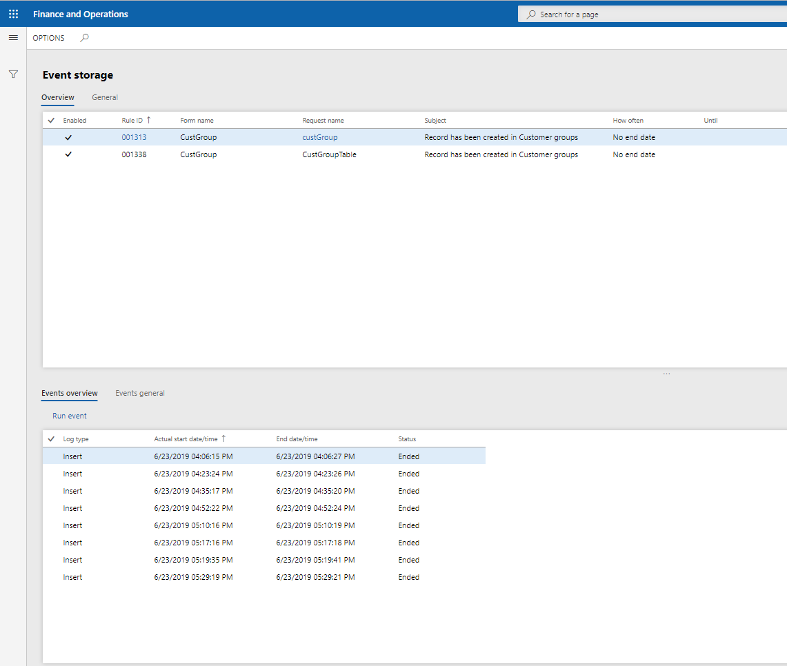
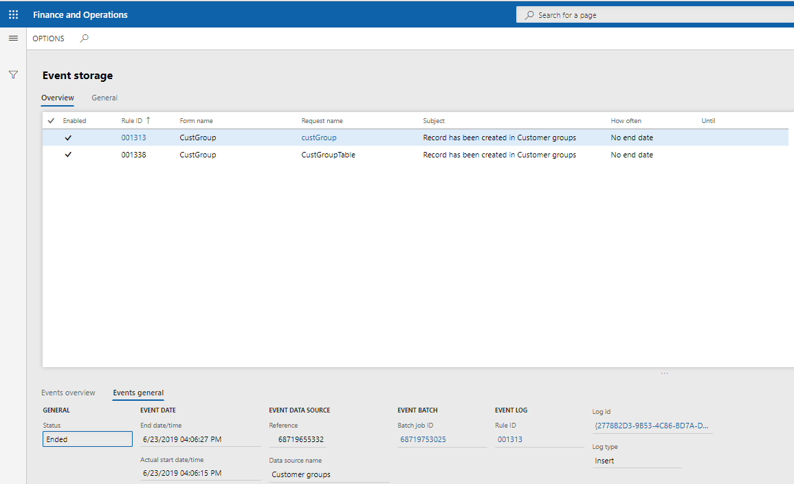

# Історія подій 

Для відображення створенних подій з використанням механізму `AxChange` інує сховище подій. За допомогою цієї форми можна прослідкувати всі активні правила події, їх налаштування та історію викликів. Перейдіть в `Organization administration` -> `Ax Change` -> `Event` -> `Event storage`.

В верхній частині відображаться всі `AxChange` правила подій. Також на вкладці `General` відображається детальна інформація. 
В нижній частині форми відобрається інформіціє про всі запуски правила. Також, `AxChange`дозволяє повторно запустити подію `Run event`.
На вкладці `General` відображається інформіцію про статус події, джерело данних і деяка додаткова інформація.

