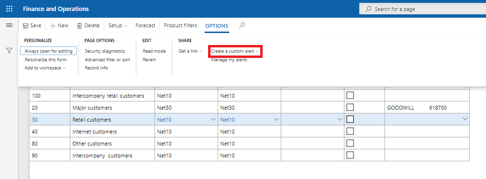
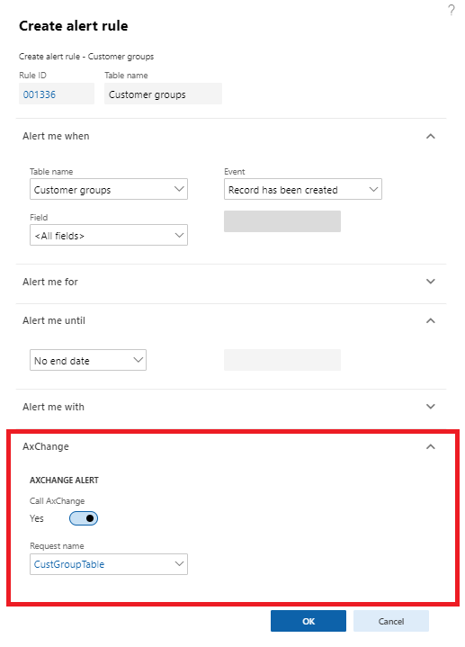

# Налаштування 

Продукт `AxChange` дозволяє підписуватись на події і виконувати запити в фоновому режимі. Користувач може налаштувати трігер на деяку подію і в разі відбуття цієї події спрацюють механізми `AxChange`. Данний функціонал бузується на роботі `Alert` і є розширенням данного функціоналу.

Для стоврення `Ax Change події` на жаданій формі натисніть `Option` -> `Create a custom alert`.

На формі що відкриється перейдіть на вкладку `AxChange` та натисніть `Виклати AxChange(Call AxChange)` - Так. Та оберіть `Ім'я запиту(Request name)`.

Після чого в разі спрацюванні створенного правила, разом з ним і виконується функціонал `AxChange`.