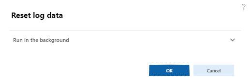
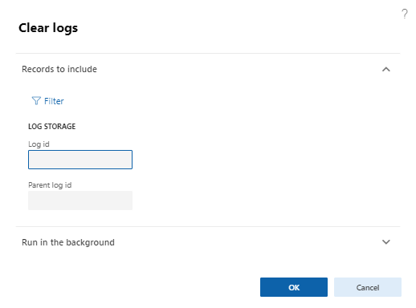

# Періодичні операції

При використанні механізму логування є обов'язковим налаштуванням періодичної операції `Reset log data`. Дана операціє має бути запущена як періодична з рекомендованою частотою в 24 години, для зберігання логів в сховищі, та очищення допоміжних дельта таблиць. Шлях `Organization administration` -> `AxChange` -> `Logs` -> `Reset log data`.

Періодична операція `Clear logs` - представляє механізм повного очищення сховища логів. Періодичність залежить від навантаження на `Ax Change` і повина виконуватись адміністратором системи. Шлях `Organization administration` -> `AxChange` -> `Logs` -> `Clear logs`.

