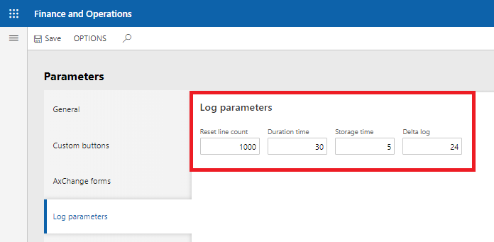

# Налаштування 

Продукт `AxChange` також має свій унікальний мехінізм логуваня. За допомогою логів можна відслідкувати етап виконання процесу і його статусу. При виконані операції для покращення перфоменсу всі логи зберігаються в пам'яті і тільки по завершенню операції зберігаються в базі данних. Механізм логування допомагає відслідковувати статус операції, а також діагностувати проблеми під час виконанні `AxChange` запитів.

Також `AxChange` має додаткові оптимізаційні налаштування для поліпшення роботи лог процесу. В `Organization administration` -> `Ax Change` -> `Setup` -> `AxChange parameters` -> `Log parameters`.

> `(К-сть ліній для збереження в базу)Reset line count` - максимальна к-сть лог повідомлень, що збирігається в пам'яті. Після перевищення данного значення, в сховеще логів буде збереженні повідомлення.

> `(Максимальний час виконання процесу)Duration time` - максимальна тиривалість виконання процесу. Час в хвилинах після якого процес буде важатись не закінченим.

> `(Час зберігання логів)Storage time` - максимальна час зберігання логів в оперативній пам'яті після завершення процесу, необхідний для показу інформаціних повідомлень.

> `(Різниця логів)Delta log` - періодичність очищення таблиці дельта логів. Необхідна для відслідування логів, що вже збереженні в сховищі.