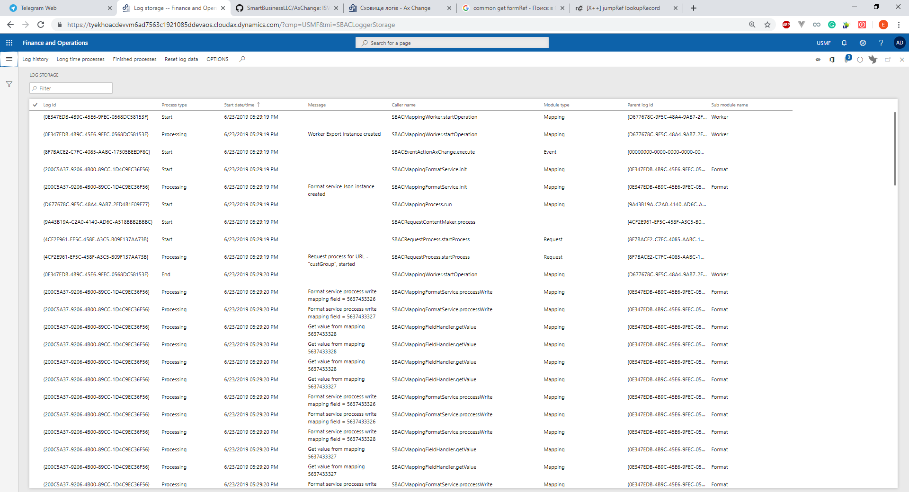
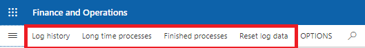
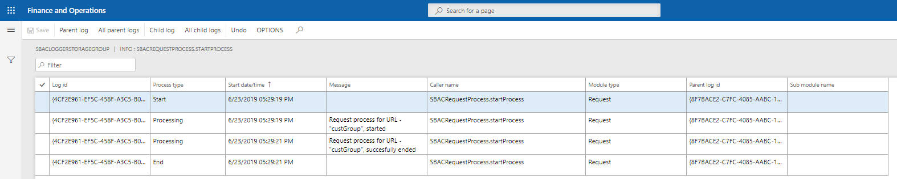

# Сховище логів

Для перегляду інформації про логи переійдіть в `Organization administration` -> `Ax Change` -> `Setup` -> `Logs` -> `Log storage`.

На даній формі можна побачити інформацію про всі закінчині процеси, їхні етапи виконання та статус. 
Кожний процес може мати статуси `Process type` : `Start` - при стоверенню процесу, `End` - при завершенні, `Processing` - в етапі виконанні, `One call` - виконаний без батьківського процесу. Кожен процес може мати батьківській процес, та породити нові процеси. `Parent log id` - {00000000-0000-0000-0000-000000000000} означаэ корневий(початковий процес). Також на даній формі можна побачи час початку процесу `Start data/time`, його батьківський процес `Parent log id`, модуль в якому був запущений процес `Module type`, та повідомлення лога `Message`.

Для відслідковування більш детальної інформації, чи структівати її можна скористатись кнопкою `Log history`.

> Дана форма відсортовує форму по `Log id`, а також дозволяє побачити більш детально ієархію процесів по батьківському процесу чи породженому процесу.

> `Long time processes` - відсортовує процеси, в яких максимальний час виконання перевищений.

> `Finished process` - показує всі успішно завершенні процеси.

> `Reset log data` - зберігає дані що знаходяться в пам'яті в сховищі данних.