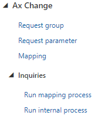

# Введеня

Для роботи з данними в `AxChange` рішенні вбудований механізм співсталення. Співсталення представляє собою гнучкий функіонал роботи з данними. Данний механізм включає в себі обробку вхідний данних формату `JSON`, eкспорт, імпорт данних, а також імпорт за допомогою DMF. 
Налаштування співставлення знаходяться в `Organization administration` -> `Ax Change` -> `Mapping`

Налаштування співставлення представляє собою налаштування груп, де можна обрати назву, опис групи, конфігурацію, а також тип групи. На данний момент в системі реалізовані `Парсинг`, `Експорт`, `Імпорт`, `DMF Імпорт`.

# Базові налаштування 

Поля `Mapping name` та `Mapping processing type` є обов'язковими для заповнення. Поле `Mapping name` - унікальне значення групи, поле `Mapping processing type` - відповідає за тип співставлення. 

?> Більше інформації о типах співставлення і іх налаштування читайте в розділі `Типи співставлення`.

# Завантаження Bookmarks

Для поліпшення роботи із заповенням тегів `Тег(Bookmark)` деякі форми мають додатковий функіонал завантаження тегів. При цьому завантаженні теги стають доступні для вибору із випадаючого списку.

Натисніть кнопку `Завантажити теги(Upload bookmark)`. Після чого можна побачити форму в полі `Browse` обиріть шлях до файлу та натисніть `Upload`. 

Завантажені теги можна побачити в випадаючому списку.

