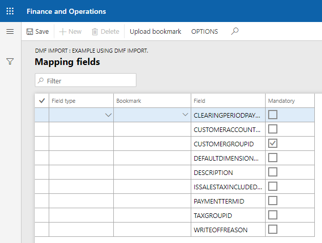

# Налаштування 

Рішення `Ax Change` дає можливість завантаження данних за допомогою механізма `DMF`. Коли йдеться про велику к-сть данних варто скористатись саме данним функціоналом.
Для початку необхідно створити проект на `DMF` імпорт в розділі `System administration` -> `Data management` -> `Import`.


Та укажіть `Name`, `Source data format`, `Entity name` налаштування.

!> `Source data format` поле повинно мати значення `CSV`.

Та заванатажте імпортуємий файл `Upload data file` для створення мапінгу в `DMF`.

Для створення співставлення `DMF Імпорт` на формі групп співставлення створіть нову группу, та обиріть `Mapping processing type` - `DMF import`. В полі `Джерело данних(Data source name)` укажіть ім'я створенного проекту в `DMF`. Перейдіть на вкладку `Mapping fields`.


На формі співставлення необхідно налаштувати співставлення вхідного об'єкту(`JSON`) до створенного мапінга в `DMF` проекті. Відкривши форму співставлення ви одразу побачити всі поля налаштованого `DMF` мапінгу.

Поля для заповення

> `Поле(Field)` - назва поля із `DMF` мапінгу.

> `Обов'язкове(Mandatory)` - показує обов'язковість поля для заповнення.

> `Тип поля(Field type)` - тип поля для заповення. В системі доступні типи полів `Text(Текст)`, `Object(Об'єкт)`. 

?> `Text(Текст)` - заповнює поле із `DMF` мапінгу константним значенням із поля `Тег(Bookmark)`.

?> `Object(Об'єкт)` - заповнює поле із `DMF` мапінгу значеннях із вхідного об'єкту, де в `Тег(Bookmark)` записують назву букмарки.

?> В випадку коли значення не указане поле буде пропущене для заповення.


## Приклади використання

Налаштуємо імпорт данних із джерела данних `CustCustomerGroupEntity` для схеми `JSON`.

```text
[
    {
	    "CustomerGroupId":"Import",
	    "Description":"Group add use AxChange import."
    },
    {
	    "CustomerGroupId":"10",
	    "Description":"Update using AxChange import."
    }
]
```
В розділі `System administration` -> `Data management` -> `Import` створемо новий проект на імпорт та завантажемо мапінг для `CustCustomerGroupEntity`.


Створемо нову группу співставлення із `Mapping processing type` - `DMF import`. Та укажемо в якості джерела данних створену `DMF` группу.


Після цього ми можемо побачити схему співставлення `DMF` мапінгу.



Співставемо поля `DMF` мапінгу із схемою `JSON`


Після цього налаштування `DMF Імпорт` закінченно. 