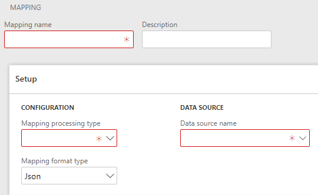

# Експорт

Співставлення представляє гнучку систему для експорту данних із `D365FO`. Одна із основних задач підчас інтеграції з іншими системи є саме вивантаження данних, рішення `Ax Change` покриває значну частину експорт задач без розробки. `Експорт` підтримує створення, а також заповнення існуючої схеми заданого формату.

# Налаштування 

Для створення співставлення `Експорт(Export)` на формі групп співставлення створіть нову группу, та обиріть `Mapping processing type` - `Export`. Також обов'язковим полем для заповення є поле `Ім'я джерела данних(Data source name)`. Джерелом данних для типу співставлення можуть виступати `таблиці` та `дата ентіті(DataEntity)`. `Ім'я джерела данних(Data source name)` - це поле з іменнем головного джерела данних. Перейдіть на вкладку `Mapping fields`.



Для співставлення типу `Експорт(Export)` доступені дві можливості налаштування. Використовуючи `схему співставлення` і `динамічно згенеровану схему`. Перевагой використання співсталення із схемою є простота налаштування, перевагою налаштування динамічно згенерованою схемою є гнучке створення експорт файлу.

### Співсталення з використанням схеми 

Для створення співтавлення в даному режимі необхідно завантажити саму схему. Для цього у вкладці `Attacment` натисніть `Browse` обиріть шлях до файлу та натисніть `Upload`. Завантажену схему можна побачити у вкладці `Preview`.


> Для того щоб завантажити теги схеми співставлення ви можете скористатись кнопкою  `Завантажити теги(Upload tag)`. В данному випадку букмарки із схеми будуть завантаженні автоматично.


## Приклади використання

Налаштуємо експорт данних із джерела данних `CustGroup` для схеми `JSON`.
```text
{
	"CustomerGroupId":"",
	"Description":""
}
```
Джерелом данних для типу співставлення можуть виступати `CustGroup` та DataEntity де головним джерелом данних є `CustGroup` наприклад DataEntity `CustCustomerGroupEntity`. 


Завантажемо схему співставлення. Для цього у вкладці `Attacment` натисніть `Browse` обиріть шлях до файлу та натисніть `Upload`. Завантажену схему можна побачити у вкладці `Preview`.


Скористаємось кнопкою  `Завантажити теги(Upload tag)` для завантаження тегів співставлення.


> Кнопка `Очистити об'єкт(Clear object)` на вкладинці `Attacment` очищає завантаженний обєкт від значень.
> Кнопка `Видалити(Delete object)` на вкладинці `Attacment` повністью видаляє завантажений об'єкт.