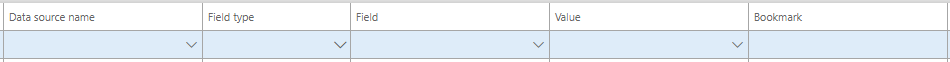
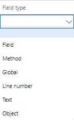
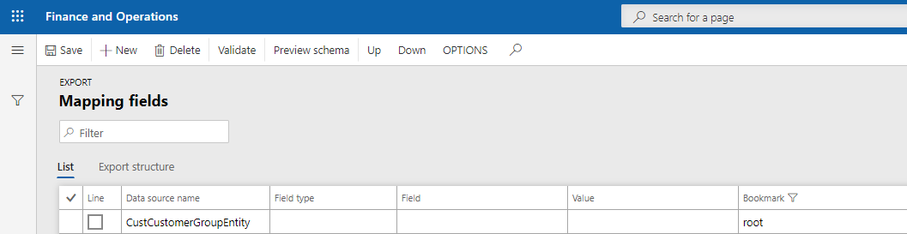
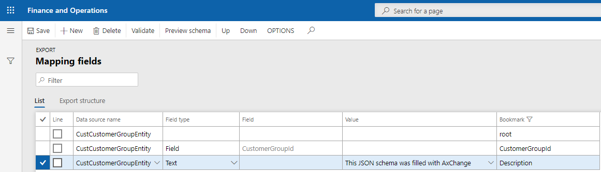
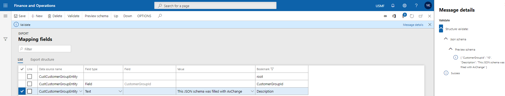

# Базові налаштування

На формі співставлення налаштовується відповідність тегів обєкта(`JSON`) до джерел данних із системи.

Співставлення кожної схеми повинно починатись з `кореневого(root)` елементу.

Поле `Bookmark` відповідає значеню тега із схеми. 

Поле `DataSourceName` відповідає значенню джерела данних із системи. За замовченням воно відповідає значенню головного джерела данних.

Поле `Field type` відповідає типу заповнення поля.



В системі на данний момент доступні такі типи `Field type`:



> `Поле(Field)` - обравши значення `Field` тег `Bookmark` буде заповнений значенням поля джерела данних. Де поле `DataSourceName` - це поле джерела данних, а поле `Field` - це назва поля жаданного значення.

> `Метод(Method)` - обравши значення `Value` тег `Bookmark` буде заповнений значенням результатом роботи метода на джерелі данних `DataSourceName`. Де поле `DataSourceName` - це поле джерела данних, а поле `Value` - це назва методу на об'єкті `DataSourceName`. За допомогою данного функіоналу можна викликати методи які не приймають вхідні параметри, чи мають вхідні параметри за замовченням і повертають значення своєї роботи.

> `Глобальний(Global)` - данний тип завонює тег `Bookmark` значенням роботи методу на глобальному классі `Global`. Значення `Value` заповнюється назвою метода що буде викликано. Також в метод що буде викликано, першим вхідним параметром можливо передати значення поля джерела данних, вказавши назву поля в полі `Field`. Для типу `Глобальний(Global)` можуть використовуватись лише методи що вертають значення своєї роботи.

> `Текст(Text)` - данний тип заповнює тег `Bookmark` константним значенням що було введено в поле `Value`.

?> Якщо тип `Field type` не було обрано, то заповнення тегу не відбудеться, і його значення не змінтиться.

# Приклади використання 

Заповенемо значеннями `JSON` схему, де тег `CustomerGroupId` дорівнює значення поля `CustomerGroupId` дата ентіті  `CustCustomerGroupEntity`. А тег `Description` має константне значення `This JSON schema was filled with AxChange`.

```text
{
	"CustomerGroupId":"",
	"Description":""
}
```
Співставлення кожної схеми повинно починатись з `кореневого(root)` елементу, данний елемент не може бути видаленний, та в базовому налаштуванні не може бути зміненний. 



Для заповнення `CustomerGroupId` `Bookmark` оберемо `Field type` значення `Поле(Field)`, а в полі `Field` назву поля `CustomerGroupId`.

Для заповнення `Description` `Bookmark` оберемо `Field type` значення `Текст(Text)`, а в поле `Value` запишемо `This JSON schema was filled with AxChange`.



!> Для перевірки коректності схеми скористайтесь конпкою `Перевірка(Validate)`. Результатом перевірки буде сформований `JSON` об'єкт. А джерелом табличних данних буде перший випадковий табличний буфер.

