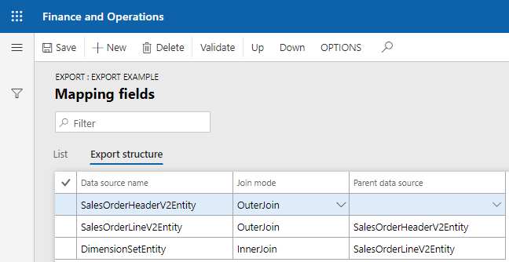

# Додаткові можливості співставлення 

## Порядок заповнення схеми 

При заповненні схеми об'єкта дуже важливим є порядок заповнення данних. Для того що вказати порядок заповення данних скористайтесь кнопками `Вверх(Up)` та `Вниз(Down)`.
За допомогою данного функціонала можна вказувати поряд заповнення данних, переміщаючи теги вверх/вниз. 


## Структура заповення схеми

`AxChange` також підтримає заповнення схеми із багатьох джерел данних. Дуже часто виникає необхідність в вивантеженні данних з декількох таблиць чи дата ентіті. Наприклад, `SalesTable-SalesLine`, 
в такому разі `AxChange` дозволяє налаштовувати структуру данних. 

Додайте необхідні джерела данних на форму співставлення. Збережіть схему та перейдіть на вкладинку `Структура експорту(Export struct)`. Для прикладу, заповнемо схему значенями 

```text
{
    "SalesOrderNum":"",
    "Item":""
}
```

Де `SalesOrderNum` - це номер замовлення із таблиці `SalesTable`, а `Item` - це `ItemId` із `SalesLine`.


На вкладинці `Структура експорту(Export struct)` ми можемо бачити всі джерела данних що використовуються в експорті данних. Поля `Тип зв'язку(Join mode)` відповідають за тип зв'язку між 
джерелами данних. Поле `Батьківське джерело данних(Parent)` показує яке джерело данних є корневим. 

В нашому випадку джерело данних `SalesLine` має батьківським джерелом данних `SalesTable`.


> Данний функіонал дозволяє експортувати структури данних будь якої складності.

## Шапка-лінії 

`AxChange` підтримує схеми об'єктів шапка-лінії(Наприклад `SalesTable-SalesLine`). В цьому випадку одному корновому елементу може відповідти декілька вкладенних об'єктів.
Розглянемо наприкладі данний випадок. Припустимо нам необхідно заповнити схему `JSON` вигляду  

```text
{
    "SalesOrderNum":"",
    "SalesLines":[
        {
            "Line":""
        }
    ]
}
```
де `SalesOrderNum` - номер заказу на закупку. А `Line` - номер лінії в цьому замовленні. Подібних ліній може бути необмежена кількість. В результаті `jObject` 
```text
{
    "Line":""
}
```
повиненн заповнитись такуж к-сть раз що ліній в замовленні. Тобто для замовлення SalesOrderNum = 1 із двома лініями, заповненна схема має вигляд. 

```text
{
    "SalesOrderNum":"1",
    "SalesLines":[
        {
            "Line":"1"
        },
        {
            "Line":"2"
        }
    ]
}
```

Данний функіонал реалізованний за допомогою додаткового поля `Лінія(Line)`. При заповненні полів що мають зв'язок один до багатьох вкажіть значення поля `Лінія(Line)` - `Так`.
В цьому випадку перший батьківський елемент схеми тега буде продубльваний, тобто в схемі вище першим батьківським елемнтом тегу `Line` є `jObject` елемент

```text
{ "Line":""}  
```
саме він буде скопійований та поміщений в елемент тегу `jArray []`
```text
"SalesLines":[].
```
?> Тобто в якості батьківських елементів для ліній можуть виступати лише об'єкті типу `jObject {}` і `jArray []`. Більш детально читайте [Newtonsoft](https://www.newtonsoft.com/json/help/html/N_Newtonsoft_Json_Linq.htm)

# Приклад використання

Створемо співставлення для схеми

```text
{
    "Document": {
        "SalesOrderHeaderV2Entity": {
            "CURRENCYCODE": "",
            "INVOICECUSTOMERACCOUNTNUMBER": "",
            "ORDERINGCUSTOMERACCOUNTNUMBER": "",
            "COMPANY":"",
            "ORDERTYPE":"",
            "DELIVERYADDRESSPARTY":"",
            "SalesOrderLineV2Entity": [
                {
                    "LINE":"",
                    "ITEMNUMBER": "",
                    "LINEAMOUNT": "",
                    "SALESPRICE": "",
                    "SALESPRICEQUANTITY": "",
                    "SHIPPINGSITEID": "",
                    "DIMENSIONS":[]                    
                }
            ]
        }
    }
}
```

Створемо нову групу співставлення та завантажемо схему співставлення, де головним джерелом данних є `SalesOrderHeaderV2Entity`. В результаті отримали шаблон для налаштування.  


Поля шапки `SalesOrderHeaderV2Entity` заповняємо полями з дата ентіті.

 Букмарку `COMPANY` заповнємо типом `Глобальний(Global)` поля `Field type` назва методу `getCompany` а вхідним парметорм котрого є `TableId`.  
 
 Для заповення значення тегу `DELIVERYADDRESSPARTY` скористаємось методом на дата ентіті `deliveryAddressPartyRecId` тип `Метод(Method)`. 
 
 Тег `ORDERTYPE` має константне значення `Sales order` тип `Текст(Text)`.

Оскільки схема потребує заовнення лініями. А зв'язок `SalesOrderHeaderV2Entity` до  `SalesOrderLineV2Entity` 1:n. Скористаємось функіоналом заповнення ліній. 
Теги що будуть заповнені лініями помітемо значеннями  `Лінія(Line)` в `Так`. 

Та змінемо джерело данних на `SalesOrderLineV2Entity`.

Для заповення тегу `LINE` - номер по порядку скористаємось типом `Field type`:

> `Линія(Line number)` - данний тип заповнює тег `Bookmark` номером лінії по порядку.

Для заповнення тегу `DIMENSIONS` використаємо зв'язану з `SalesOrderLineV2Entity` дата ентіті `DimensionSetEntity`.


Останім етапом налаштування є налаштування структури експорту. Перейдіть на вкладку `Структура експорту(Export struct)`. І налаштуйте тип звязків джерел данних, а також структуру експорту.

 

Протестуємо схему `JSON`

