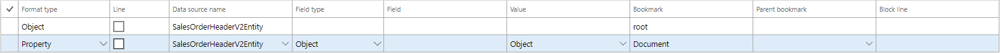

# Динамічна схема

`AxChange` також підтримує створення динамічної схеми. В випадку, коли ви не маєте в наявності схеми об'єкту `AxChange` має налаштування для створення подібної схеми.
В випадку коли не має прикіпленого файлу доступні додаткові поля для заповнення. 


?> `Тип формотування (Format type)`, `Батьківська букмарка(Parent bookmark)`, `Блок для линії(Block line)`


?> `Тип формотування (Format type)`- поле відповідає за тип обєкту. Наразі для схеми типу `JSON`. Досутні типи токенів як `Об'єкт(Object)`, `Список(Array)`, `Властивість(Property)` і `Значення(Value)`. Більш детально читайте [Newtonsoft](https://www.newtonsoft.com/json/help/html/N_Newtonsoft_Json_Linq.htm)

Приклади `JSON` токенів:
> `Об'єкт(Object) = ` ``` {} ``` - може бути додане до токену `Array`, може бути значенням для типу `Property` і `Value`.

> `Список(Array) = ` ``` [] ``` - може бути значенням для типу `Property` і `Value`.

> `Властивість(Property) = ` ``` "Value" : "Text" ```

> `Значення(Value) = ` ``` Text ```


?> `Батьківська букмарка(Parent bookmark)` - являється посиланням на батьківську букмарку. За допомогою даного поля можна створювати струкуру схеми. 

?> `Блок для линії(Block line)` - являється посиланням на блок лінії. За допомогою даного поля можна створювати струкуру схеми для ліній. Повідінка букмарки такаж як і в `Батьківська букмарка(Parent bookmark)` лише для `Ліній(Line)` дорівнює `Так`.


# Приклад використання

Створемо співставлення для схеми типу 

```text
{
    "Document": {
        "SalesOrderHeaderV2Entity": {
            "CURRENCYCODE": "",
            "INVOICECUSTOMERACCOUNTNUMBER": "",
            "ORDERINGCUSTOMERACCOUNTNUMBER": "",
            "COMPANY":"",
            "ORDERTYPE":"",
            "DELIVERYADDRESSPARTY":"",
            "SalesOrderLineV2Entity": [
                {
                    "LINE":"",
                    "ITEMNUMBER": "",
                    "LINEAMOUNT": "",
                    "SALESPRICE": "",
                    "SALESPRICEQUANTITY": "",
                    "SHIPPINGSITEID": "",
                    "DIMENSIONS":[]                    
                }
            ]
        }
    }
}
```
Заповнення значень схеми можна побачити в модулі [Додаткові налаштування](/ua/mapping_export_basic_add.md)

Оскільки при створенні динамічної схеми значення букмарки може бути не лише значення і системи а і об'єкт схеми. Для таких випадків варто скористатись типом `Field type`:
Для заповення тегу `root` -  `Field type`:

> `Об'єкт(Object)` - данний тип заповнює тег `Bookmark` об'єктом схеми. Більш детальніше з об'єктами схеми ви можете ознайомитись пункті меню `Приклади JSON токенів`.
Значення для об'єкту виберіть в полі `Значення(Value)`.


Корневим елементом схеми є елемент `root` `Тип формотування (Format type)` є `Об'єкт(Object)`. 

```text
{}
```


`root` елемент містить елемент `Document` що є `Властивість(Property)`. А тег `Document` містить в собі об'єкт типу `Об'єкт(Object)`.

```text
{
    "Document": {}
}
```

Заповнемо значення полів для тегу `Document`



!> Оскільки кожний об'єкт в схемі повинний починатись із `root` елемента, тег для `Батьківська букмарка(Parent bookmark)` вказувати на `root` елемент не потірібно.

Аналогічні дії і властивості виконуємо для тегу `SalesOrderHeaderV2Entity`. Однак значення для `Батьківська букмарка(Parent bookmark)` вказуємо значення тегу `Document`.


```text
{
    "Document": {
        "SalesOrderHeaderV2Entity":{}
    }
}
```


Значення `CURRENCYCODE` містить в собі значення поля із дата ентіті `SalesOrderHeaderV2Entity`. Тобто, `Field type` дорівнює значенню `Поле(Field)`.

```text
{
    "Document": {
        "SalesOrderHeaderV2Entity":{
            "CURRENCYCODE": ""
        }
    }
}
```


Всі інші букмарки для для схеми шапки заповнються аналогічно

```text
{
    "Document": {
        "SalesOrderHeaderV2Entity": {
            "CURRENCYCODE": "",
            "INVOICECUSTOMERACCOUNTNUMBER": "",
            "ORDERINGCUSTOMERACCOUNTNUMBER": "",
            "COMPANY":"",
            "ORDERTYPE":"",
            "DELIVERYADDRESSPARTY":""
        }
    }
}
```


Тег `SalesOrderLineV2Entity` хоч і являється типом `Тип формотування (Format type)` є `Властивість(Property)` але в собі має значення типу `Список(Array)`.

```text
{
    "Document": {
        "SalesOrderHeaderV2Entity": {
            "CURRENCYCODE": "",
            "INVOICECUSTOMERACCOUNTNUMBER": "",
            "ORDERINGCUSTOMERACCOUNTNUMBER": "",
            "COMPANY":"",
            "ORDERTYPE":"",
            "DELIVERYADDRESSPARTY":"",
            "SalesOrderLineV2Entity": []
        }
    }
}
```


Наступні теги заповнються тегами лінії тому нам необхідно заповнюкавати додаткове поле `Блок для линії(Block line)` по такому ж принципу як і `Батьківська букмарка(Parent bookmark)`. Тільки з посилання на блок ліній. 

В букмарку `DIMENSIONS` поміщають значення `Список(Array)` в котрий поміщають `Значення(Value)`. 

!> Значення поля `Тег(Bookmark)` є обов'язковим лише для `Властивість(Property)`. Але для полегчення навігації по схемі варто створювати унікальні назви букмарок.


Останім етапом налаштування є налаштування структури експорту. Перейдіть на вкладку `Структура експорту(Export struct)`. І налаштуйте тип звязків джерел данних, а також структуру експорту.

 

Протестуємо схему `JSON`

