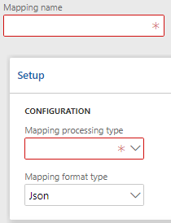

# Імпорт

Для завантаження данних в `D365FO` можна скористатись `Імпорт` співсталенням. Це гнучкий механізм обробки данних та завантеження їх в систему з перевіркою коректності данних.



# Налаштування 

Для створення співставлення `Імпорт(Import)` на формі групп співставлення створіть нову группу, та обиріть `Mapping processing type` - `Import`.  Перейдіть на вкладку `Mapping fields`.


На формі співставлення `Імпорту` доступні наступні поля для заповнення.


> `Дата ентіті(Data entity)` - назва ентіті, що буде заповнюватись данними із вхідного об'єкту.

> `Поле(Field)` - назва поля ентіті, що буде заповнюватись данними із вхідного об'єкту.

> `Джерело імпорту(Import source)` -  назва ентіті, з котрого буде братись значення для заповнення.

> `Тег(Bookmark)` - ім'я букмарки, значеням котрої буде заповненне поле `Дата ентіті(Data entity)`.

> `Обов'язкове(Mandatory)` - показує обов'язковість поля на вибраній ентіті.

> `Тип джерела імпорту(Import source type)` - тип джерела данних що буде використовуються для заповнення.


?> `Об'єкт(Response)` - джерелом вхідних данних виступає об'єкт відповіді запиту. В цьому випадку необхідно вказати ім'я букмарки значення с якої будуть братись для заповнення `Дата ентіті(Data entity)`.

?> `Дата ентіті(Data Entity)` - джерелом вхідних данних виступує `Data Entity`. В цьому випадку необхідно вказати в полі `Джерело імпорту(Import source)` назву дата ентіті з якої будуть вибрані дані, а в поле `Тег(Bookmark)` - обрати назву поля.


## Автоматичне сторення ліній 

Рішення `Ax Change` дозволяє створювати автоматично лінії. Для цього натисніть кнопку `Створити лінії(Create lines)`.


Оберіть ентіті поля котрої потрібно додати. 

!> Якщо вказати значення `Обов'язкове(Mandatory)` будуть додані лише обов'язкові поля.


Після цього на форму будуть автоматично додані поля обраної дата ентіті.

## Приклади використання

### Приклад із CustGroup

Налаштуємо імпорт данних із джерела данних `CustCustomerGroupEntity` для схеми `JSON`.

```text
[
    {
	    "CustomerGroupId":"Import",
	    "Description":"Group add use AxChange import."
    },
    {
	    "CustomerGroupId":"10",
	    "Description":"Update using AxChange import."
    }
]
```

Базовий вигляд `CustGroup` 


Де  об'єкт `"CustomerGroupId":"Import"` не існує. В результаті чого повинна бути створенна нова `CustGroup`.

```text
{
    "CustomerGroupId":"Import",
    "Description":"Group add use AxChange import."
}
```

А  об'єкт `"CustomerGroupId":"10"` повинний бути оновлений.

```text
{
    "CustomerGroupId":"Import",
    "Description":"Group add use AxChange import."
}
```

В результаті співставлення для імпорту буде мати вигляд.


За допомогою кнопки `Preview import` можна перевірити коректність данних і ствренної схеми.  


В полі `Browse` обиріть шлях до файлу з даними та натисніть `Upload`. 


В результаті можна побачити результат роботи імпорту


?> Всі зміни що внесенні за допомогою кнопки `Preview import` відновлюються до початкових значень.

### Приклад із SalesOrder

Налаштуємо імпорт данних із джерел данних `SalesOrderHeaderV2Entity`, `SalesOrderLineV2Entity` для схеми `JSON`.

```text
{
    "Document": {
    "SalesOrderHeaderV2Entity": {
        "CURRENCYCODE": "USD",
        "INVOICECUSTOMERACCOUNTNUMBER": "DE-001",
        "ORDERINGCUSTOMERACCOUNTNUMBER": "DE-001",
        "SalesOrderLineV2Entity": [
        {
            "ITEMNUMBER": "D0001",
            "LINEAMOUNT": "127.000000",
            "SALESPRICE": "13.000000",
            "SALESPRICEQUANTITY": "1.000000",
            "SHIPPINGSITEID": "6"
        },
        {
            "ITEMNUMBER": "D0003",
            "LINEAMOUNT": "777.000000",
            "SALESPRICE": "18.000000",
            "SALESPRICEQUANTITY": "2.000000",
            "SHIPPINGSITEID": "6"
        }]
      }
    }
}
```
Співставимо всі поля із вхідної `JSON` схеми до полів джерел данних 


Наступним кроком є створення `Струкутри імпорту(Import structure)`. Оскільки наша `JSON` схема має два джерела данних і при цьому `SalesOrderHeaderV2Entity` має зв'язок `SalesOrderLineV2Entity` 1:n. В структурі схеми потрібно вказати тег букмарки для `SalesOrderLineV2Entity` і зв'зок до `SalesOrderHeaderV2Entity`.


Ще одним обов'язковим полем для заповнення є номер жунала для `SalesOrderLineV2Entity`, що буде згенерований в `SalesOrderHeaderV2Entity`. Для цього створіть лінії з значеням `Дата ентіті(Data Entity)` поля `Тип джерела імпорту(Import source type)`. Та укажіть поле та назву дата ентіті з якої буде взято значення для заповнення. 


За допомогою кнопки `Preview import` можна перевірити коректність данних і ствренної схеми.  


