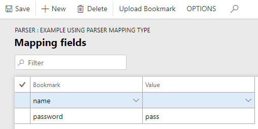

# Парсер

Тип `Парсер(Parser)` реалізує логіку обробку вхідних данних до зрузного системі формату. За допомогою данного функціоналу можна отримувати значення із інших запитів (наприклад значення для авторизацій).

# Налаштування 

Для створення співставлення `Парсер(Parser)` на формі групп співставлення створіть нову группу, та обиріть `Mapping processing type` - `Parser`.  Перейдіть на вкладку `Mapping fields`. 


На формі `Mapping fields` налаштовуються поля співставлення. Кожному атрібуту(букмарці) вхідного джерала данних відповідає значення що буде використовуватись системі. Дана форма в режимі `Парсер(Parser)` має два поля: `Bookmark`, `Value`. `Value` - це тег атрибуту із вхідного джерала данних.  `Bookmark` - це ім'я тегу яке буде видеме в системі.

?> Поле `Value` може бути пустим. В цьому випадку в якості шуканого значеня із вхідного джерала данних буде використовуватись значення поля `Bookmark`.

## Приклади використання

### Token authorization

Перейдіть на форму `Organization administration` -> `Ax Change` -> `Mapping`. Створіть групу с типом `Mapping processing type` - `Parser`. Та перейдіть в `Mapping fields`.


Створимо співставлення для схеми с токеном.

```text
{
  "authenticated": true,
  "token": "080042cad6356ad5dc0a720c18b53b8e53d4c274"
}
```
Схема співставлення.


Налаштування пареметрів запиту `Organization administration` -> `Ax Change` -> `Request parameter`


### Basic authentication 

Перейдіть на форму `Organization administration` -> `Ax Change` -> `Mapping`. Створіть групу с типом `Mapping processing type` - `Parser`. Та перейдіть в `Mapping fields`.


Створимо співставлення для схеми с basic authentication.

```text
{
	"name":"passName",
	"pass":"pass123!"
}
```
Схема співставлення.

?> Значення поля `Value` для `name` може бути пустим. Адже воно має таке ж значення як в тегу JSON схеми.



Налаштування пареметрів запиту `Organization administration` -> `Ax Change` -> `Request parameter`.

