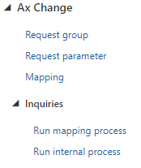
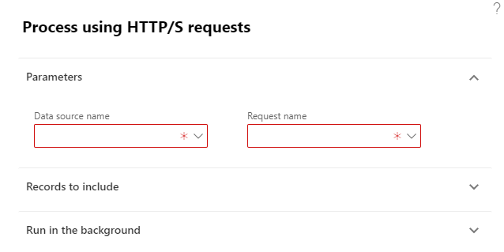
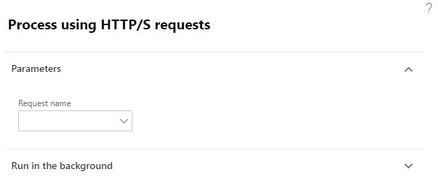
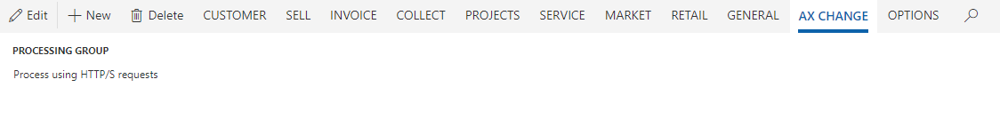

# Quick start

Для того щоб почати працювати з рішенням, потрібно мати систему `Microsoft Dynamics 365 for Finance and Operations (10)`, вставновлене рішення `AxChange` і користувача з роллю `Smart Ax Change` або `System administrator`. Після чого можна розпочинати налаштовувати інтеграційні процеси

## Ініціалізація

Кожен запит повинен міститись в групі `Request group`. Додаткові відомості дивись у посібнику [Request group](/ua/requestGroup.md).

Після того як група створена, можна створювати пов'язані з нею запити. Детальніше у посібнику [Request](/ua/request.md).

Також до кожного запиту можна додати `Actions`, що будуть спрацьовувати при отриманні відповіді із відповідним статус кодом. Детальніше у посібнику [Actions](/ua/actions.md).

## Запуск

Створювати запити можна за допомогою двох пунктів меню, що знаходяться в `Organization administration` -> `Ax Change` -> `Inquiries`

Пункт меню `Run mapping process` дозволяє створювати запити, які в своєму тілі містять прив'язування до таблиці або сутності (параметр `Only for internal` в значенні `No`).

Пункт меню `Run internal process` дозволяє створювати запити, що не залежать від будь-яких інших сутностей, тобто для створення запиту не потрібно генерувати додаткові дані, вся інформація міститься в параметрах для нього (параметр `Only for internal` в значенні `Yes`).

?> Створювати запити можна також з будь якої форми системи, що містить джерело даних яке є в одній із `Request group`. Список з доступних запитів буде сформовано відповідно до обраного запису на формі. Для вибору будуть доступні всі запити в яких група має джерело даних ідентичне обраному. Пункт меню знаходиться на вкладці `AX CHANGE`.

