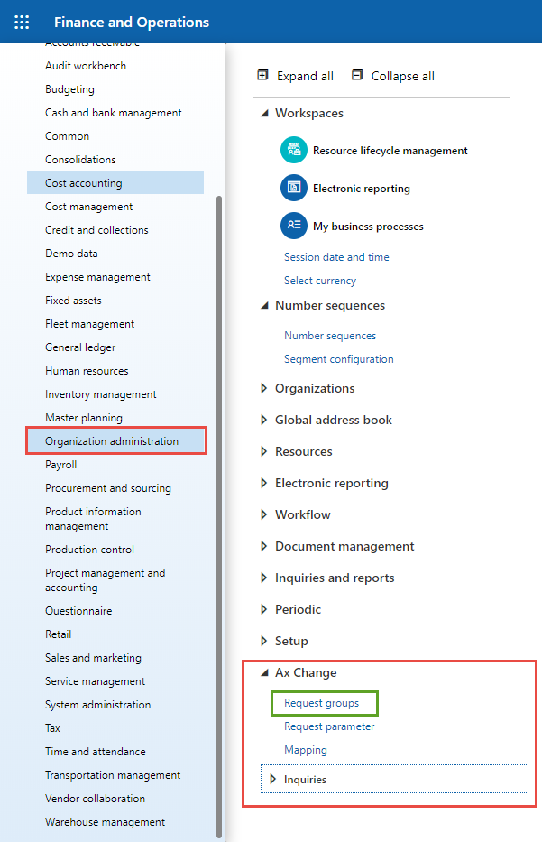
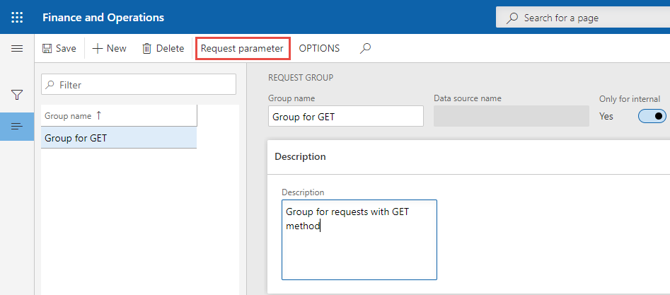

# Request group

Для зручного групування та перегляду запитів існують групи запитів. Кожен запит прив'язаний до групи. Груп може бути скільки завгодно і кожна група може мати скільки завгодно запитів.

Наприклад, структура груп може виглядати так:

```text
└── Request groups
    ├── Group for POST requests
        ├── POST 1
        └── POST 2
    ├── Group for GET requests
      ├── GET 1
    └── Group for PUT requests
        ├── PUT 1
        └── PUT 2
        ├── PUT 3
        └── PUT 4
```

## Створення

Щоб створити групу оберіть модуль `Organization administration`, далі пункт `Ax Change` і у списку відкрийте форму `Request group`.



## Заповнення

Для успішного створення групи потрібно заповнити поле `Group Name`.

> Поле `Data source name` потрібно заповнювати в залежності від встановленого параметру `Only for internal`. Якщо він в значенні `No`, тоді поле є обов'язковим для заповнення.

Поле Description не є обов'язковим.

| Поле              | Обов'язкове                                                                                    | Опис                                                                                                                             |
| ----------------- | ---------------------------------------------------------------------------------------------- | -------------------------------------------------------------------------------------------------------------------------------- |
| Group name        | <code>Так</code>                                                                               | Ім'я групи                                                                                                                       |
| Description       | <code>Ні</code>                                                                                | Опис групи                                                                                                                       |
| Only for internal | <code>Ні</code>                                                                                | Тільки для внутрішнього використання, тому цей запис не може бути пов'язаний з системним об'єктом. Група не містить джерел даних |
| Data source name  | <code>Ні</code> якщо `Only for internal` встановлено <code>Так</code>, інакше <code>Так</code> | Основне джерело даних для всіх запитів в групі                                                                                   |

> При зміні параметру `Only for internal` значення в полі `Data source name` очищуєься.

Також на формі присутня кнопка `Request parameter` натиснувши на яку можна перейти до форми пов'заних з групою запитів. Детальніше про запити у посібнику [Request parameter](/ua/requestParameter.md).


