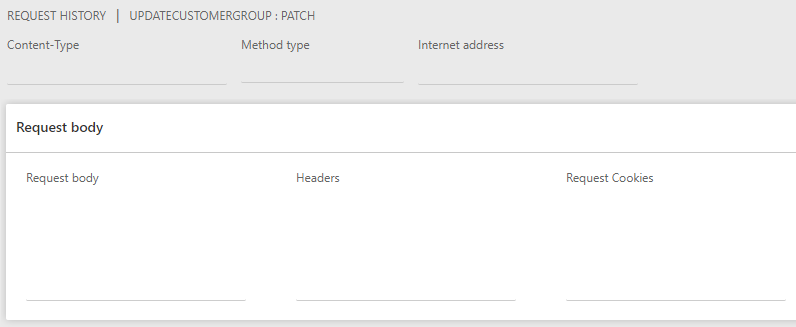

# Request History

Кожен запит в кінцевому вигляді представляє собою структуру яка містить набір полів, які заповнюються на основі тих даних, що були введенні при налаштуванні параметрів для запиту.

Даний список полів виглядає так:

| Поле             | Опис                                  |
| ---------------- | ------------------------------------- |
| Content-Type     | Тип тіла запиту                       |
| Method type      | Метод запиту                          |
| Internet address | URL адреса                            |
| Request body     | Тіло запиту                           |
| Headers          | Заголовки запиту (пара ключ:значення) |
| Request Cookies  | Cookie запиту                         |

?> Жодне з полів не можна змінювати

На панелі дій форми знаходиться дві клавіші - [`Response history`](/ua/responseHistory.md) та [`Request parameter`](/ua/requestParameter.md). Перша відкриває пов'язану із створеним запитом відповідь, а інша відповідно пов'язане налаштування для запиту.

> Для одного запиту в історії запитів міститься лише один запис в історії відповідей.

> Запис в історії запитів не може існувати без запису в історії відповідей і навпаки.
