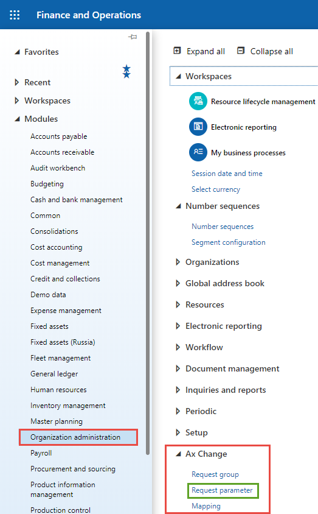
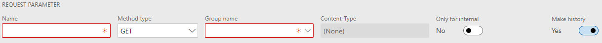
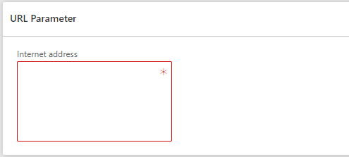
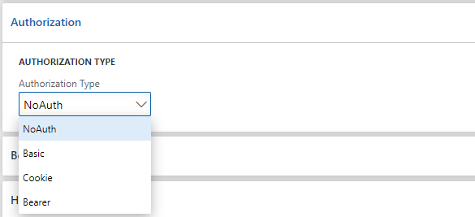
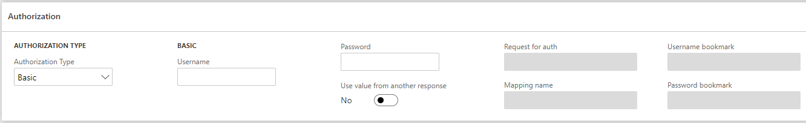

# Request parameter

Параметри це один з ключових елементів у процесі налаштування інтеграційних процесів. Дана структура слугує для налаштування запитів які будуть відправлятись зовнішній системі по протоколу HTTP чи HTTPS. При створенні параметрів для запитів можна додавати засіб авторизації чи включати дані, що будуть згенеровані системою за допомогою структури `Mapping`. Детальніше про пов'язування у посібнику [Mapping](/ua/mapping.md).

Повну структура параметрів для запиту можна представити так:

```text
└── Request parameter
    ├── Authorization
      ├── Only one of existing
    └── Body
        ├── For Text | Form-urlencoded | binary only one of existing
        └── Form-body
          ├── How much do you need
          └── ...
    └── Headers
        ├── How much do you need
        └── ...
    └── Certificate
        ├── Only one of existing
```

## Створення

Щоб створити параметр оберіть модуль `Organization administration`, далі пункт `Ax Change` і у списку відкрийте форму `Request parameter`.



## Заповнення

Для успішного параметрів для запиту потрібно заповнити поля `Name`, `Group name` та `Internet address` (знаходиться в табі `URL Parameter`).

> Поле `Group name` буде встановлено автоматично, якщо відкриття форми параметрів відбулось з форми `Request group`.

### Базові параметри

При відкритті форми, за замовчуванням, ми бачимо всі основні поля.


Поля `Name` та `Group name` є обов'язковими для заповнення.

Поле `Method type` також є обов'язковим, але завжди містить значення за замовчуванням і є типом з набором допустимиих значень (лише ті, що доступні у випадаючому списку).

Параметр `Content-Type` заповнюється автоматично і згідного обраного типу даних, які будуть передаватись при створення запиту.

Поле `Only for internal` слугує індикатором того, чи є параметр запитом для внутрішнього використання, тобто не містить основного джерела даних і може бути створеним вручну користувачем або викликаний іншим запитом. Наприклад отримання токену для авторизації іншого запиту.

Поле `Make history` є параметром який свідчить про те, чи буде вестить історія створених запитів та відповідоней від них. За замовчуванням значення встановлено в `Так`.

| Поле              | Обов'язкове                                  | Опис                   |
| ----------------- | -------------------------------------------- | ---------------------- |
| Name              | <code>Так</code>                             | Ім'я параметрів запиту |
| Method type       | <code>Так (за замовчування GET)</code>       | Ім'я параметрів запиту |
| Group name        | <code>Так</code>                             | Ім'я параметрів запиту |
| Content-Type      | <code>Ні</code> (недоступне для редагування) | Ім'я параметрів запиту |
| Only for internal | <code>Ні</code>                              | Ім'я параметрів запиту |
| Make history      | <code>Ні</code>                              | Ім'я параметрів запиту |

### Розділ URL Parameter

Поле `Internet address` є обов'язковим полем і повинно містити веб-адресу до стороннього сервісу. Наприклад:

```text
https://httpbin.org/get
```



Поле можна змінювати в будь-який момент часу.

### Розділ Authorization

В даному розділ форми можна налаштувати дані для авторизації запиту, тобто HTTP заголовку Authorization який буде формуватись згідно налаштувань і додаватись до аргументів кінцевого запиту.



Авторизація може бути наступних типів:

- [`Basic`](/ua/requestParameter?id=basic-authorization)
- [`Bearer`](/ua/requestParameter?id=bearer-authorization)
- [`Cookie`](/ua/requestParameter?id=cookie-authorization)

Також вона може бути відсутня зовсім, в такому випадку ніяких додаткових запитів або операцій по формуванню заголовку Authorization не буде.

#### Basic authorization

Даний тип авторизації потребує даних про логін та пароль користувача.
Також є можливість отримати параметри за допомогою відповіді від іншого запиту.



Поле `Use value from another response` дозволяє налаштувати отримання даних, що прийдуть у відповідь при відправці іншого запиту.
